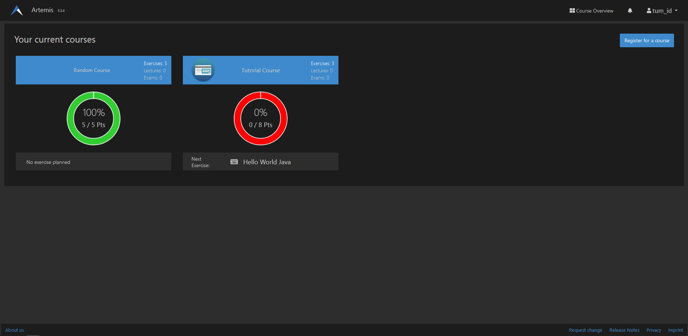
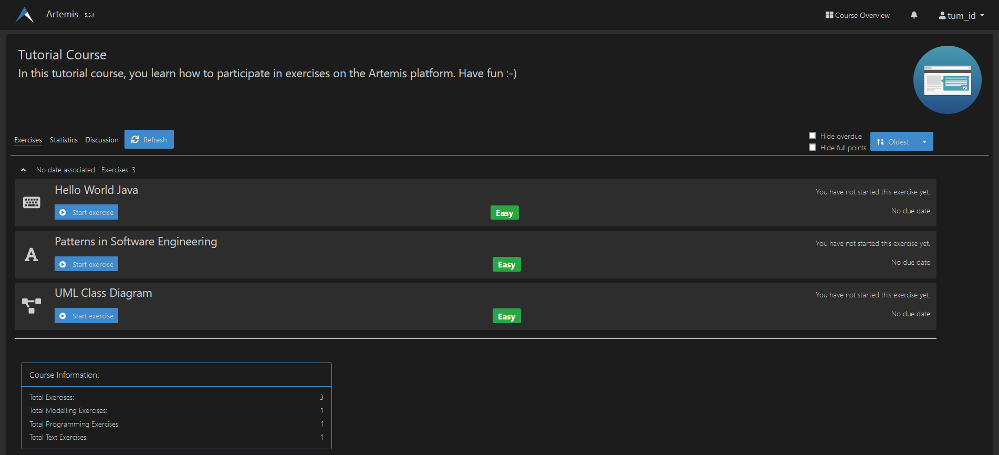
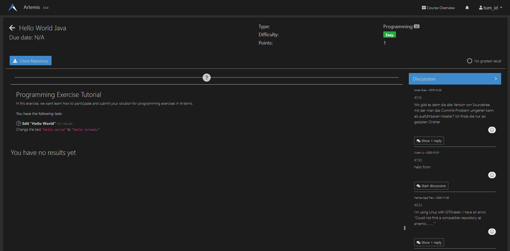

# General
This project adds a dark mode for the [Artemis Site](https://artemis.ase.in.tum.de).
It contains a browser extension that is working on firefox as well as chrome / all chromium based browsers.







# Getting started
## Via the webstore
### Chrome
The package may be found and installed via the [chrome web store](https://chrome.google.com/webstore/detail/artemis-darkmode/gijmcmgbmbciflkifmmmhbdleiifcbdk).

## Manual setup
### Cloning the repository
First you need to download the repository by either opening a terminal, changing into the desired directory and using
```git clone https://github.com/Attednev/ArtemisDarkMode.git ``` to clone the repository. Note that for this git has to be installed on your system.

If you don't have git or are unsure on how to use it, then you can scroll to the top, press the green "code" button and download the project as a zip-archive. Note that you first have to unzip the archive before continuing.

### Adding the extension to your browser
#### FireFox
To add this extension on firefox, open up firefox and enter ```about:addons``` into the search bar and open it up. Now move to the ```Plugins``` tab and select ```Install Add-on From File``` after clicking on the cogwheel. For the last step you just have to choose the ```.xpi``` file that is inside the project folder.

#### Chrome
To add this extension to chrome, just open up your Chrome browser, enter ```chrome://extensions/``` into your searchbar and open it up.
Once your on the site, enable the ```Developer mode``` in the top right corner and click ```load unpacked```. Now select the downloaded folder and reload the page if you already have it open.
